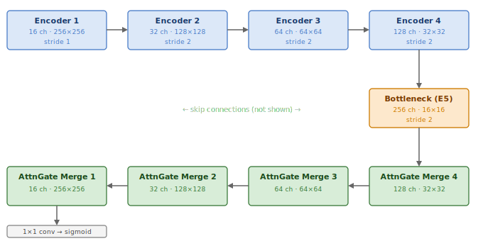
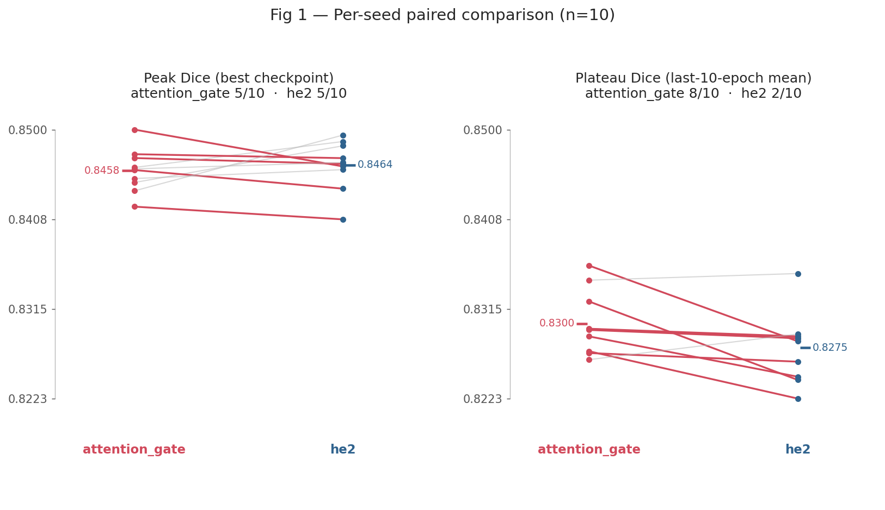
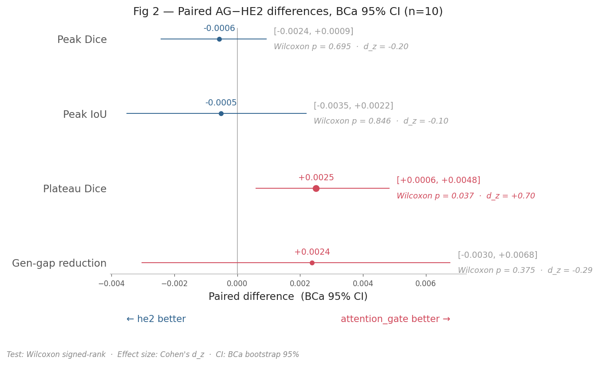

# SkiNet — Skin Lesion Segmentation with a Custom UNet2D

Binary segmentation of dermoscopic skin lesions on **ISIC 2017**, using a UNet2D built from scratch in PyTorch

A single checkpoint at the default threshold reaches an **IoU of 0.7494**, which places
SkiNet **just outside the top 7** of the official ISIC 2017 Task 1 leaderboard.

Full documentation is built with Sphinx and hosted at **<https://pkliui.github.io/SkiNet/>**.

<p align="center">
  
</p>

---

## Headline result

Selected production checkpoint (`seed 108`, `epoch 192`, `classical + attention_gate`,
`lr = 3e-4`), scored **once** on the 600-image held-out test split using the official
ISIC-2017 per-image averaging. The threshold is the untuned default τ = 0.5 (see [E4](#e4--decision-threshold) for why).

| Metric | Score | 95 % bootstrap CI |
|---|:---:|:---:|
| **Dice @ 0.5** | **0.8356** | [0.8208, 0.8494] |
| **IoU @ 0.5** | **0.7494** | — |

### How it compares to the ISIC 2017 leaderboard

<p align="center">
  
</p>

| Rank | Team | IoU (Jaccard) |
|---|---|:---:|
| 1 | Mt. Sinai | 0.765 |
| 2 | NLP LOGIX / WISEEYEAI | 0.762 |
| 3 | USYD-BMIT (MResNet-Seg) | 0.760 |
| … | … | … |
| 7 | NedMos — Tarbiat Modares University | 0.749 |
| **~8** | **SkiNet UNet2D (this work, @0.5)** | **0.7494** |
| 8 | INESC TEC Porto / Tecnalia | 0.735 |

*Source: [challenge.isic-archive.com/leaderboards/2017](https://challenge.isic-archive.com/leaderboards/2017/).*
SkiNet lands **0.0004 behind rank 7** and **0.016 behind the 2017 winner** — a competitive
result for a clean baseline. The 2017 entrants were scored on the same held-out split, so the
comparison is metric-equivalent. Three factors explain the gap closing: attention gates
([Oktay et al., 2018](https://arxiv.org/abs/1804.03999)) postdate the competition, modern
training methodology (Adam at lr = 3e-4, Optuna sweeps, Lightning loop), and best-of-ten-seed
checkpoint selection on validation.

---

## How the model was chosen — the experiment pipeline

Each decision is documented in a self-contained analysis notebook in
[`analysis_results/`](analysis_results/), with pre-registered metrics, paired statistics
(Wilcoxon + BCa bootstrap), and an explicit decision section. Summary below.

### E0 — Batch size

*What per-GPU batch size to train at on a T4.* Treated as a throughput knob, **not** as a
model hyperparameter. Swept `bs ∈ {4, 8, 16, 32, 64, 128}`; chose the smallest batch that
saturates the GPU (≥ 80 % util) while staying on the throughput plateau and well within the
16 GB envelope. → **bs = 16** (80 % util, 0.72 GB peak).
[Notebook ›](source/E0-batch-size-sweep-analysis-unet2d-isic2017.ipynb)

<p align="center">
  
</p>

### E2 — Architecture tie-break (10 seeds)

*Attention gate (AG) vs. HE2 residual merge, both at lr = 3e-4.* Paired across 10 shared
seeds (100–109) so only the architecture varies within a pair. AG wins the pre-registered
primary metric — **plateau Dice 0.8300 vs 0.8275** (Δ +0.0025, Wilcoxon p = 0.037, d_z = +0.70,
8/10 seeds); peak accuracy is a dead tie; HE2 is 13 % faster. → **Lock `classical` encoder +
`attention_gate` merge.** [Notebook ›](analysis_results/E2-isic2017-unet2d-model-tiebreak-10seed.ipynb)

<p align="center">
  
</p>
<p align="center">
  
</p>

### E4 — Decision threshold

*Does a validation-tuned threshold τ\* beat the default τ = 0.5?* The in-sample gain is substantial
(+0.0203 Dice, p = 0.002) but **τ\* fails both deployability tests**: it straddles 0.5 across
seeds (median 0.46, SD 0.106) and never converges within a run (range [0.06, 0.81]). The gain
is an artefact of fitting τ on the evaluation set. → **Retain τ = 0.5.**
[Notebook ›](analysis_results/E4-isic2017-unet2d-threshold-selection.ipynb)

### EF — Held-out test score

The locked model and fixed threshold are run **once** over the 600-image test split, producing
the headline result above. No threshold or model choice is made on the test set.
[Notebook ›](analysis_results/EF_isic2017_unet2d_E4_production_model_selection.ipynb)

---

## Main features

- **Custom UNet2D** from scratch — configurable encoder/decoder residual modes (classical,
  He2, SE, attention gate, local refinement)
- **Pydantic config** validated from YAML — every field typed and defaulted
- **Optuna HPO** (GridSampler) with nested MLflow run tracking
- **RepeatDataLoader** — persistent workers, no per-epoch respawn
- **Mixed precision** (`16-mixed`) auto-applied on CUDA
- **Per-epoch threshold sweep** (51 thresholds), multi-seed training (`run_seeds.py`) - final training uses the fixed threshold
- **ONNX export** for mobile / runtime deployment
- **Azure Blob Storage** via blobfuse2 and `AzureMachineLearningFileSystem`

> **Expected input size.** The model is trained and deployed at **256×256**. ISIC 2017 is
> resized to 256 (`ISIC2017DATA_256`) and the exported ONNX
> graph has fixed 256×256 spatial dimensions — **inputs must be resized to 256×256 before
> inference.** RGB, normalised with `NORM_MEAN = [0.699, 0.556, 0.5121]` and
> `NORM_STD = [0.1576, 0.1562, 0.1706]`.

---

## Quick start

Development runs **inside a Docker container** (Ubuntu 22.04 + a micromamba `skinet`
environment pinned to Python 3.11 — `azureml-fsspec` requires it). The image has `cpu` and
`gpu` build targets; use `gpu` for CUDA-accelerated training. See
[docs › development](docs/source/development.md) for the full Docker / Lightning Studio setup.


### Get the data without Docker

You don't need to build or run the container to download ISIC 2017 — the dataset is fetched
on the **host**:

```bash
# Download manually with the kaggle CLI
pip install kaggle                       # needs ~/.kaggle/kaggle.json credentials
export ISIC_OUT_DIR=$HOME/data/isic2017  # any host dir you own
mkdir -p "$ISIC_OUT_DIR"
kaggle datasets download -d johnchfr/isic-2017 -p "$ISIC_OUT_DIR" --unzip
```

Data lands in `$ISIC_OUT_DIR` on the host and is later bind-mounted into the
container or used directly.

### Fastest path — Lightning Studio scripts (`on_start_gpu.sh` / `on_start_cpu.sh`)

The startup scripts do everything for you — clone/update the repo, pull the prebuilt image
(`pkliui/skinet:v9gpu` / `v9cpu`), download ISIC 2017 to `$ISIC_OUT_DIR` on first run, launch the
container (data bind-mounted at `/mnt/data/`, MLflow on port 5000), and dispatch to the right
entry point via `MODE`. On **Lightning Studio** the data dir defaults to Lightning Storage
"/teamspace/lightning_storage/isic2017/ISIC2017DATA_256";
**anywhere else, point it at your own host directory first** — the `export`s below apply to every
command in the block:

```bash
# Choose where data lives — every command below inherits these. On Lightning Studio you can
# skip them (they default to Lightning Storage). ISIC 2017 is auto-downloaded into ISIC_OUT_DIR
# if empty; for PH2 you must place the data in PH2_DATA_DIR yourself.
export ISIC_OUT_DIR=$HOME/data/isic2017   # ISIC 2017 host data dir (use a path you own; Studio default: /teamspace/lightning_storage/isic2017/ISIC2017DATA_256)
export PH2_DATA_DIR=$HOME/data/ph2        # PH2 host data dir (only used when DATASET=ph2)

# Single training run  (default dataset isic2017; add DATASET=ph2 for PH2)
RUN_TRAINING=true MODE=train bash on_start_gpu.sh
```

> `RUN_TRAINING` defaults to **`false`** (a dry-run guard) — set `RUN_TRAINING=true` to launch a
> real job (`interactive` ignores it and always opens a shell). The GPU is **kept** after a run
> unless you pass `RELEASE_GPU=true`. Swap in `on_start_cpu.sh` for CPU-only work. Full reference
> (every `MODE` and env var — `DATASET`, `ENCODER_MODES`, `MERGE_MODES`, `RELEASE_GPU`, …):
> [docs › development](docs/source/development.md#lightning-studio).
>
> **Specify your own data path.** By default the scripts read/write data under Lightning
> Storage, but the host data directory is overridable per dataset — set `ISIC_OUT_DIR`
> (ISIC 2017) or `PH2_DATA_DIR` (PH2) to point anywhere, e.g.
> `ISIC_OUT_DIR=$HOME/data/isic2017 RUN_TRAINING=true MODE=train bash on_start_gpu.sh`, or
> `DATASET=ph2 PH2_DATA_DIR=$HOME/data/ph2 RUN_TRAINING=true MODE=train bash on_start_gpu.sh` for PH2.
> Pick a directory you own — pointing at a root-owned location like `/data` makes the Kaggle
> download fail with `Permission denied`; if you must use one, `sudo chown -R "$(id -u):$(id -g)" /data/isic2017` first.


### Interactive development (manual Docker)

For hands-on debugging, or on any non-Studio machine, build the image and open a shell in the
container yourself:

```bash
git clone https://github.com/pkliui/SkiNet.git && cd SkiNet

# Build the container (gpu target for CUDA; swap --target cpu for CPU-only dev)
ENV_HASH=$(sha256sum environment.yaml | cut -c1-64)
docker build  --no-cache --build-arg ENV_HASH=$ENV_HASH --target gpu -t skinet:gpu .

# Download ISIC 2017 on the HOST first (see "Get the data without Docker" above), e.g.
ISIC_OUT_DIR=$HOME/data/isic2017  # any host dir you own (Studio default: Lightning Storage)
mkdir -p "$ISIC_OUT_DIR"
kaggle datasets download -d johnchfr/isic-2017 -p "$ISIC_OUT_DIR" --unzip

# Run it, bind-mounting the repo and the data dir (data then appears at /mnt/data).
# Mounting $ISIC_OUT_DIR is essential: without it, anything written to /mnt/data lives only
# in the container's ephemeral layer and is lost when the container is removed. On a
# non-Studio machine, point ISIC_OUT_DIR at any writable host directory.
docker run -it --gpus all \
  -p 5000:5000 \
  --mount type=bind,src="$(pwd)",dst=/workplace/SkiNet \
  --mount type=bind,src="$ISIC_OUT_DIR",dst=/mnt/data \
  skinet:gpu bash
```

Inside the container the `skinet` env is already active. The data is already at `/mnt/data`
via the mount above — build the metadata CSV and train:

```bash
# Build metadata CSV from the mounted data
python -m SkiNet.ML.datasets.preprocessing.metadata_csv_factory \
  --dataset-key-str ISIC2017 --local-data-root /mnt/data

# Train (in main_config.yaml set azure_data: False, local_data_root: "/mnt/data/")
bash start_mlflow.sh
python main_run.py --config main_config.yaml      # MLflow UI at http://localhost:5000

# Sweep / multi-seed / export
python optuna_sweep.py --config main_config.yaml
python run_seeds.py    --config main_config.yaml --seeds 42 100 200
python export_onnx.py  --run <mlflow_run_dir>
```

---

## Repository layout

```
SkiNet/
├── SkiNet/
│   ├── Azure/            Azure Blob Storage integration
│   ├── ML/
│   │   ├── configs/      Pydantic configs (ExperimentConfig, TrainConfig, ...)
│   │   ├── datasets/     SegmentationDataset, CSV builders, preprocessing
│   │   ├── dataloaders/  RepeatDataLoader, create_dataloaders
│   │   ├── model/        UNet2D architecture and blocks
│   │   ├── training/     Loss functions, training utilities
│   │   └── transformations/  Albumentations pipelines
│   ├── Plotting/         Visualisation utilities
│   └── Utils/            Analysis, logging, MLops, metrics
├── analysis_results/     E0–EF experiment notebooks (the results above)
├── Tests/                pytest suite
├── docs/                 Sphinx documentation
├── main_run.py · optuna_sweep.py · run_seeds.py · calibrate_threshold.py · export_onnx.py
└── main_config.yaml
```

Full documentation (architecture, data, training, GPU performance) is built with Sphinx and
hosted at **<https://pkliui.github.io/SkiNet/>**.

---

## Citation

> Pavel Kliuiev. *SkiNet: Skin lesion segmentation with a custom UNet2D.* 2026.
> <https://github.com/pkliui/SkiNet>

Trained and evaluated on ISIC 2017:

> Codella N. et al. *Skin Lesion Analysis Toward Melanoma Detection: A Challenge at the 2017
> International Symposium on Biomedical Imaging.* [arXiv:1710.05006](https://doi.org/10.48550/arXiv.1710.05006), 2017.

## License

Copyright © 2026 Pavlo Kliuiev. All Rights Reserved. See [LICENSE](LICENSE).
